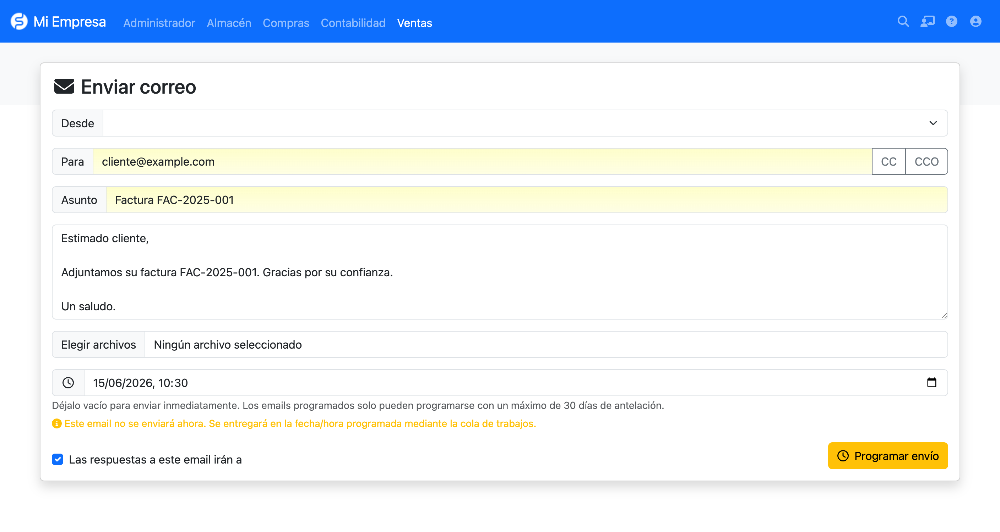

# ScheduledMail para FacturaScripts

<a href="https://erseco.github.io/facturascripts-playground/?blueprint=https%3A%2F%2Fraw.githubusercontent.com%2Ferseco%2Ffacturascripts-plugin-ScheduledMail%2Frefs%2Fheads%2Fmain%2Fblueprint.json">
  
</a><br>
<small><a href="https://erseco.github.io/facturascripts-playground/?blueprint=https%3A%2F%2Fraw.githubusercontent.com%2Ferseco%2Ffacturascripts-plugin-ScheduledMail%2Frefs%2Fheads%2Fmain%2Fblueprint.json">Pruébalo en tu navegador</a></small>

Programa el envío de emails desde el formulario de envío habitual de FacturaScripts. Elige una fecha y hora futura y el email se encola y se entrega más tarde mediante la cola de trabajos nativa (cron), en lugar de enviarse al instante.

Si dejas el campo vacío, no cambia nada: el email se envía inmediatamente con el flujo de siempre.

## Cómo funciona

El plugin añade un campo opcional **Programar envío** al formulario de envío de email (`SendMail`). Al elegir una fecha futura válida, el botón de enviar se transforma en un botón **Programar envío** de otro color y con un icono de reloj, dejando claro que el correo no se enviará en ese momento.

El email programado se guarda, sus adjuntos se copian a una carpeta propia del plugin y se registra un evento retardado con `WorkQueue::sendFuture()`. Cuando llega el momento y la cola de trabajos se ejecuta (cron), un *worker* reconstruye el email con las clases nativas (`NewMail`) y lo envía. El documento relacionado se marca como enviado solo tras la entrega correcta.

<p align="center">
  
</p>

## Características

- **Campo de programación opcional** en el formulario de envío estándar.
- **Sin cambios si está vacío**: envío inmediato como hasta ahora.
- **Fecha futura**: el email se programa y lo entrega la cola de trabajos.
- **Límite de 30 días**, validado en el **servidor** (y también en el cliente).
- **Botón dinámico**: cambia de color, icono (reloj) y texto al activar el modo programado.
- **Adjuntos persistentes**: el PDF del documento y los archivos subidos se copian a
  `MyFiles/ScheduledMail/<id>/` para que sigan disponibles hasta el envío.
- **Pantalla de gestión** (*Emails programados*) con estados y opción de cancelar los pendientes.
- **Reutiliza el núcleo**: `NewMail`, `WorkQueue` y el cron de FacturaScripts; no añade ni un
  mailer ni un cron propios.
- **Compatibilidad**: FacturaScripts 2025 y PHP 8.1 o superior.

## Uso

1. Abre cualquier documento (por ejemplo una factura) y pulsa **Enviar email**.
2. Redacta o revisa el email como siempre.
3. Opcionalmente, elige una fecha y hora en **Programar envío**:
   - Déjalo vacío para enviar inmediatamente.
   - Elige una fecha futura (hasta 30 días) para programarlo. El botón pasa a **Programar envío**.
4. Envía. Un email programado muestra una confirmación y **no** se envía en ese momento.
5. Cuando llega la hora y se ejecuta la cola de trabajos, el email se entrega y el documento
   relacionado se marca como enviado (`femail`).

Puedes revisar y cancelar los envíos en **Panel de Admin > Emails programados**.

## Instalación

1. Descarga el ZIP desde [Releases](../../releases/latest).
2. Ve a **Panel de Admin > Plugins** en FacturaScripts.
3. Sube el archivo ZIP y activa el plugin. La tabla `scheduled_mails` se crea automáticamente.
4. Asegúrate de tener configurado el **SMTP** (Admin > Email). El plugin usa la misma
   configuración de email que el envío normal.

## Requisitos

- FacturaScripts **2025** o superior (usa `WorkQueue::sendFuture()`).
- PHP **8.1** o superior.
- **El cron / la cola de trabajos debe estar configurado y en ejecución.** Los emails
  programados los entrega la cola de trabajos, que procesa el cron. Si el cron no se ejecuta,
  los emails quedan en estado `pending` y no se envían. Por ejemplo:

  ```
  */5 * * * * cd /ruta/a/facturascripts && php cron.php
  ```

## Zona horaria

La fecha/hora que eliges se interpreta en la **zona horaria de la aplicación/servidor**
(`FS_TIMEZONE`), que es la que usa FacturaScripts internamente (`Tools::dateTime()`). El límite
de 30 días y la comprobación de «debe ser futura» se validan en el servidor contra el reloj del
servidor.

## Adjuntos

Para que la programación sea segura hasta 30 días, el plugin **copia** el PDF del documento y los
archivos subidos a `MyFiles/ScheduledMail/<id>/` al programar el email. La carpeta se elimina
automáticamente tras un envío correcto o al cancelar el email.

## Solución de problemas

- **Los emails programados no se envían** → el cron / la cola de trabajos no está en ejecución.
  Configúralo (ver Requisitos). Los pendientes se entregan en cuanto la cola pase su hora.
- **Un email programado aparece como `failed`** → en *Emails programados*, la columna `error`
  muestra el motivo (normalmente la configuración SMTP). Corrige el SMTP y reprográmalo.
- **Falta un adjunto al enviar** → comprueba que existe `MyFiles/ScheduledMail/<id>/` y que los
  archivos se copiaron. Solo se borran tras un envío correcto.
- **SMTP** → el envío programado usa la **misma** configuración de email que el envío normal.

## Limitaciones

- Solo un plugin activo puede sobrescribir el controlador `SendMail` a la vez.
- No hay reintento automático: un email fallido se marca `failed` y debe reprogramarse.

## Desarrollo

- `make upd` — arranca los contenedores Docker
- `make lint` — comprueba el estilo de código
- `make format` — corrige automáticamente el estilo
- `make test` — ejecuta los tests unitarios
- `make package VERSION=1` — genera el ZIP de distribución

## Licencia

LGPL-3.0. Ver [LICENSE](LICENSE) para más detalles.
